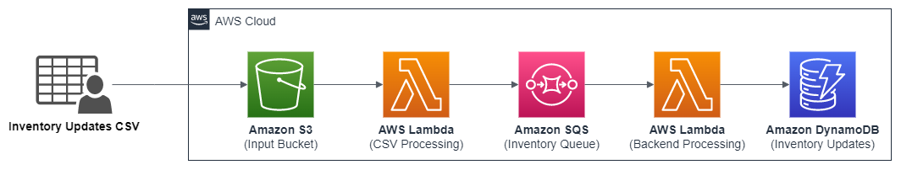

# Implementing Well-Architected Best Practices for Amazon SQS with CDK

Amazon Simple Queue Service (Amazon SQS) is a fully managed message queuing service that enables customers to decouple and scale microservices, distributed systems, and serverless applications. Customers use SQS in a variety of use-cases requiring loose coupling and high performance at any level of throughput, while reducing cost by only paying for value and remaining confident that no message will be lost. Customers building these applications are looking to build and operate their applications following best practices. 

Built around six pillars — operational excellence, security, reliability, performance efficiency, cost optimization, and sustainability — AWS Well-Architected provides a consistent approach for customers and partners to evaluate architectures and implement scalable designs. In this project, we provide CDK artifacts  written in Python to deploy an event-driven architecture taking in to consideration the SQS best practices.

## Solution Architecture



This solution architecture shows an example of an inventory management system. The system leverages Amazon S3, AWS Lambda, Amazon SQS, and Amazon DynamoDB to streamline inventory operations and ensure accurate inventory levels. The system handles frequent updates from multiple sources, such as suppliers, warehouses, and retail stores, which are received as CSV files. 

These CSV files are then uploaded to an S3 bucket, consolidating and securing the inventory data for the inventory management system's access. The system employs a Lambda function to read and parse the CSV file, extracting individual inventory update records. Each record is transformed into a message and sent to an SQS queue. Another Lambda function continually polls the SQS queue for new messages. Upon receiving a message, it retrieves the inventory update details and updates the inventory levels in DynamoDB accordingly.  

This ensures that the inventory quantities for each product are accurate and reflect the latest changes. This way, the inventory management system provides real-time visibility into inventory levels across different locations, suppliers enabling the company to monitor product availability with precision.  Find the example code for this solution in the GitHub repository.

## Deploy the architecture

Creating a python virtual environment

```
$ python3 -m venv .venv
```

After the init process completes and the virtualenv is created. Activate your virtualenv

```
$ source .venv/bin/activate
```

If you are a Windows platform, you would activate the virtualenv like this:

```
% .venv\Scripts\activate.bat
```

Once the virtualenv is activated, you can install the required dependencies.

```
$ pip install -r requirements.txt
```

At this point you can now synthesize the CloudFormation template for this code.

```
$ cdk synth
```
Deploy this stack to your default AWS account/region

```
$ cdk deploy
```
## Test the solution

Once the CloudFormation stack deploys, the terminal will output the S3 bucket name. Use the below AWS CLI command to copy the file to the S3 bucket

```
$ aws s3 cp sqs_blog/sample_file.csv s3://<bucket_name>
```

Go to [DynamoDB console](https://console.aws.amazon.com/dynamodbv2/home) and check the records in the table.

## Clean up

To delete the CloudFormation stack and remove associated resouces, use the below CDK command

```
$ cdk destroy
```

## Security

See [CONTRIBUTING](CONTRIBUTING.md#security-issue-notifications) for more information.

## License

This library is licensed under the MIT-0 License. See the LICENSE file.
